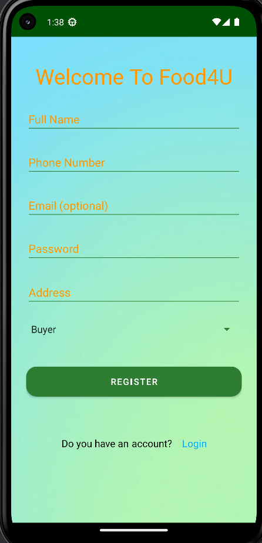
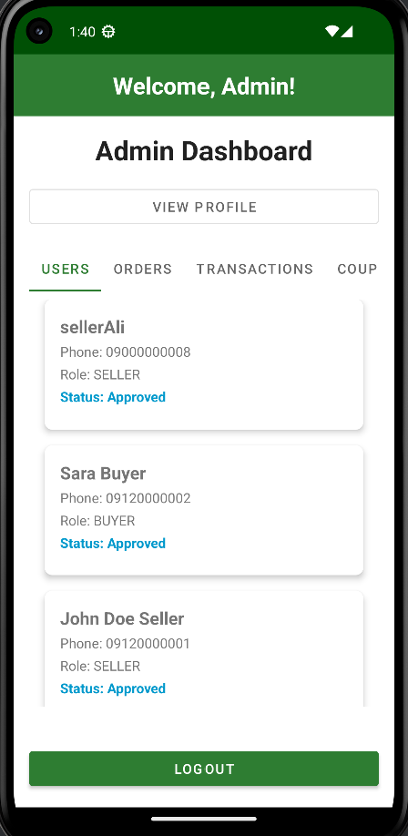
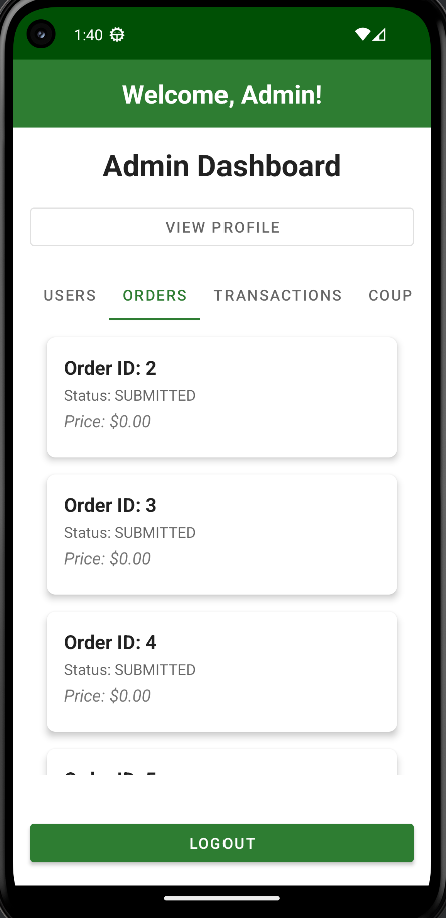
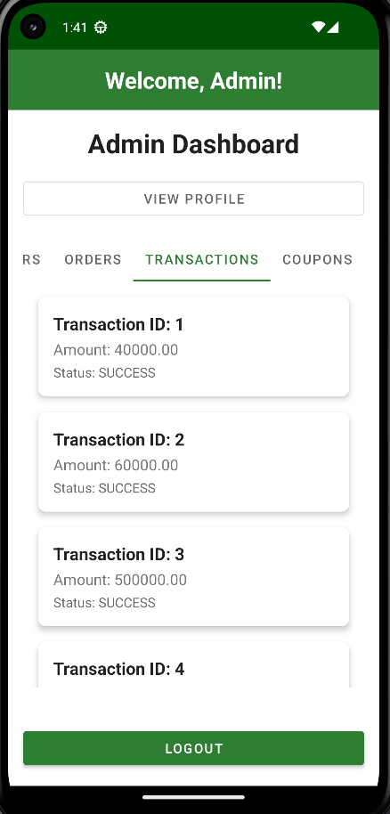
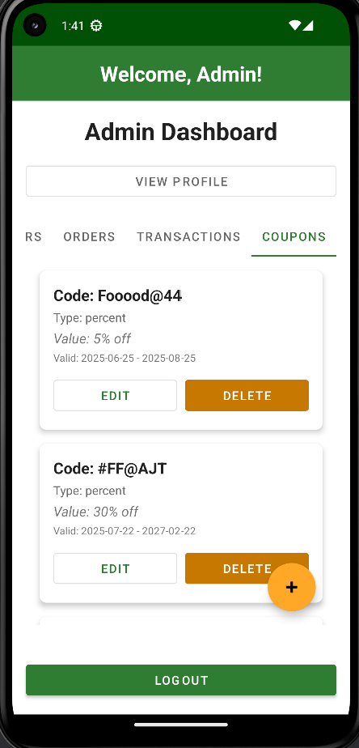
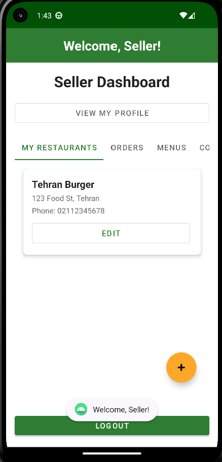
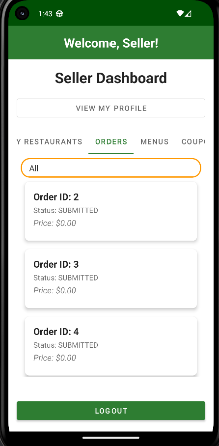
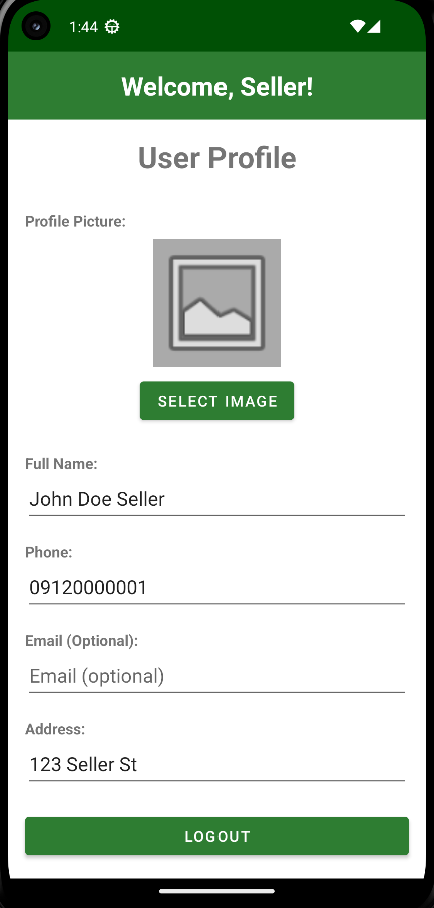
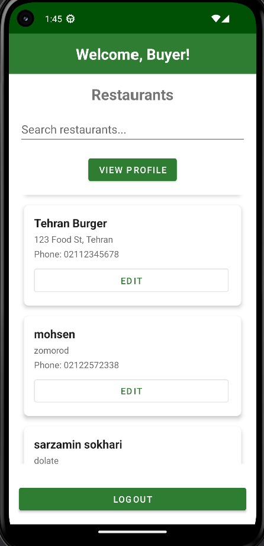

# 📱 AUT-Food Android App (Kotlin)

## 📌 Introduction

This is the **Android (Kotlin)** version of the frontend for the AUT-Food system — a multi-role food ordering platform.

The mobile app interacts with a RESTful backend API (defined in `aut_food.yaml`) and supports various user roles:

- 🛒 Customer
- 🏪 Seller (Restaurant Owner)
- 🚚 Courier
- 🔧 Admin

---

## 🧩 Features

### 🔐 User Authentication
- Role-based login and signup
- Token-based authentication
- Secure session management

### 🛍️ Customer
- Browse and search restaurants
- Filter menus and add food to cart
- Place and track orders
- Rate meals and view order history

### 🏪 Seller
- Register and manage restaurants
- Add/edit/delete food items
- View and update order statuses
- Apply discount codes
- View sales and income dashboard

### 🚚 Courier
- See assigned deliveries
- Update delivery status in real time
- Access delivery history

### ⚙️ Admin
- Approve users and restaurants
- View orders, revenue stats, and activity logs
- Manage system-level settings

### 💳 Payment & Wallet
- In-app simulated payment via wallet
- View invoices and transaction history
- Wallet recharge support

### 📲 Notifications
- Push and in-app notifications for order updates
- Realtime delivery tracking visuals

---

## 🚀 Getting Started

### 🛠️ Requirements

- Android Studio (Hedgehog or later)
- Kotlin 1.8+
- Android SDK 33+
- Internet connection to access backend API

📦 All dependencies are managed via `build.gradle.kts`

---

### ▶️ Build & Run

1. Clone the repo:

```bash
git clone https://github.com/YOUR_USERNAME/aut-food-android.git
```

2. Open the project in Android Studio

3. Configure the backend URL in `ApiClient.kt`

4. Click **Run ▶️** to build and install the app on emulator/device

---

## 🗂️ Project Structure

```
aut-food-android/
├── app/
│   ├── src/
│   │   ├── main/
│   │   │   ├── java/com/alijt/foodapp/
│   │   │   │   ├── adapter/       # RecyclerView adapters
│   │   │   │   ├── model/         # Data models
│   │   │   │   ├── network/       # Retrofit API interfaces
│   │   │   │   ├── repository/    # Data access layer
│   │   │   │   ├── utils/         # Utility classes
│   │   │   │   ├── view/          # UI screens and fragments
│   │   │   │   ├── viewmodel/     # ViewModel layer (MVVM)
│   │   │   │   └── FoodApp.kt     # Application class
│   │   └── res/
│   │       ├── layout/            # XML UI files
│   │       ├── values/            # Strings, colors, themes
│   │       └── drawable/          # Icons and images
├── build.gradle.kts
├── AndroidManifest.xml
└── README.md
```


---

## 📚 API Integration

- Uses **Retrofit** for HTTP communication
- Backend endpoints based on `aut_food.yaml` (OpenAPI 3)
- Responses handled via coroutines and sealed classes
- Data models mirror backend DTOs

---

## 🧪 Testing

- Manual testing across user flows
- Instrumentation tests with Espresso (optional)
- Compatible with Android 8.0+ devices and emulators

---

## 📣 Notes

- The app is fully integrated with the backend system
- Designed for scalability, separation of concerns (MVVM), and modularity
- Supports dark mode and responsive layouts for different screen sizes


## 📸 Preview





## 🔧 Admin Dashboard













## 🏪 Seller Dashboard











## 🛒 Customer Dashboard



